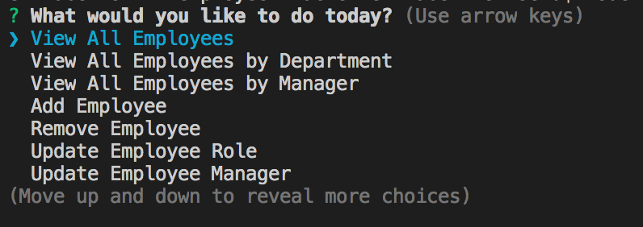
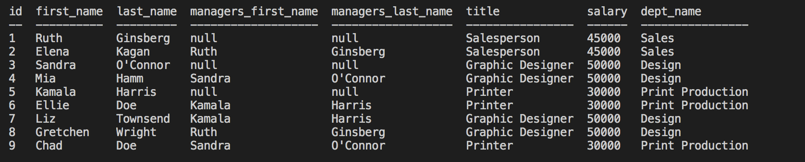
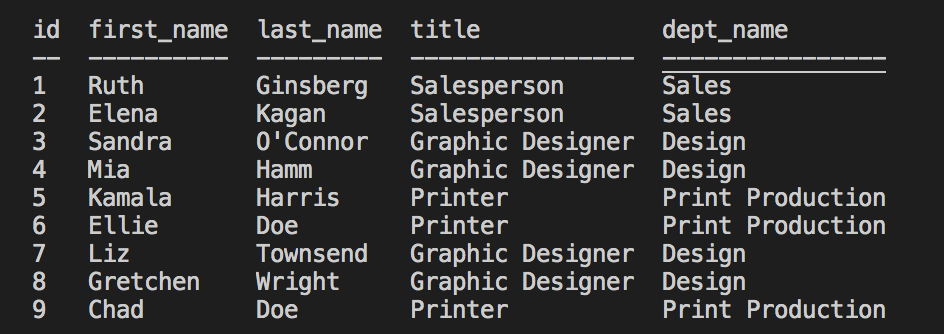
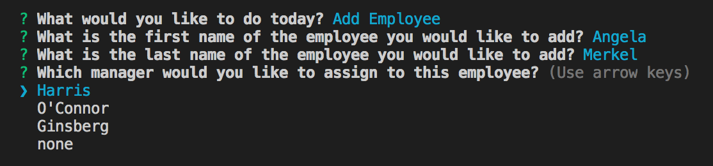
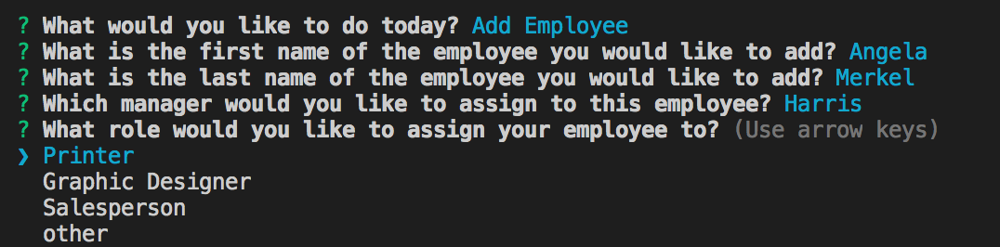

# employee-tracker

```
As a business owner
I want to be able to view and manage the departments, roles, and employees in my company
So that I can organize and plan my business
```

This is a Node-based application to manage and track employees run from the command line. Upon start, the user is presented with a list of options:



When choosing to view a list, the application pulls data from a mySQL database and returns data based on the query:

View All Employees returns the names of the employees, their managers, their role in the company, their salary and department:




Viewing by department will return a list with the role and department of the employee:



When choosing to add an employee the user is presented with prompts to walk them through adding the employee and assigning a manager and role to that new employee:





## The Code

Prompts are presented utilizing the <a href="https://www.npmjs.com/package/inquirer">Inquirer npm module</a>. The database is maintained using <a href="https://www.mysql.com/">mySql</a>. Tables are created using the <a href="https://www.npmjs.com/package/console.table">console.table npm module</a>. 


## Use

To run the program, open a terminal window in the folder and enter 
```node employeeDBConnection.js```.

Here is a video showing the appliction in use: <a href="https://drive.google.com/file/d/1jaORB-BCLwIAKqru__pwPY-q_zXXxsT-/view">Video Link</a>